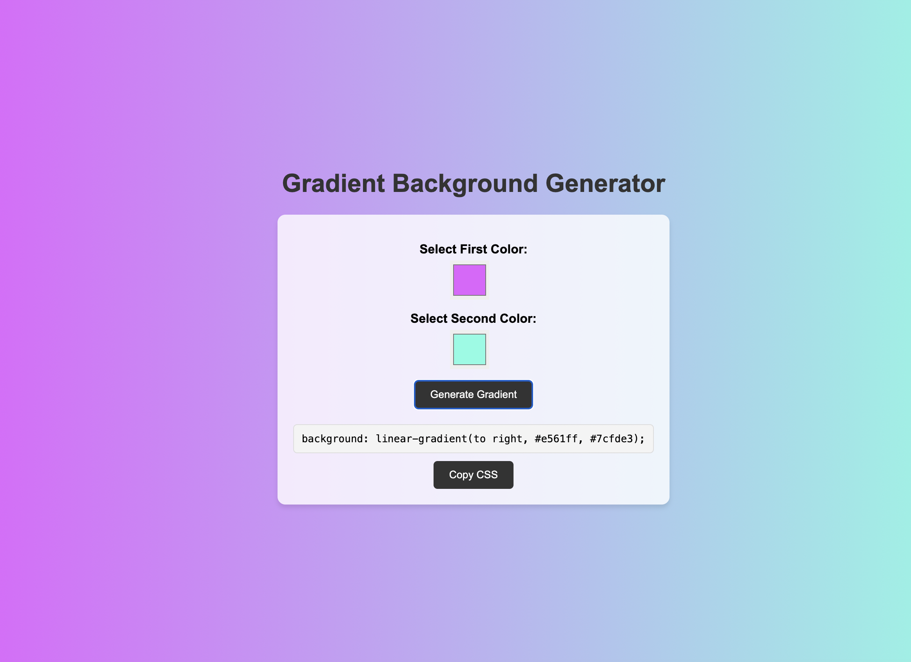

# Day 3: Gradient Background Generator

Welcome to **Day 3** of the 30-day coding challenge! 🎉 Today, we created a **Gradient Background Generator**, a tool that allows users to create stunning gradient backgrounds and copy the CSS code for their projects.

---

## 💡 Features
- **Customizable Colors:** Choose two colors to generate a unique gradient.
- **Live Preview:** Instantly see the gradient applied to the page background.
- **Copy CSS:** Copy the generated CSS code with a single click for easy use.
- **Responsive Design:** Works seamlessly on various devices and screen sizes.

---
# Demo page
Click [Here](https://ayshasanyang.github.io/Day-3-Gradient-Generator/) to view the page
---

## 🚀 How to Run
1. Download or clone the repository
```bash
git clone https://github.com/ayshasanyang/Day-3-Gradient-Generator.git
```
2. Navigate to the project folder.
3. Open the project files in your vscode or any code editor of your choice
4. Open the `index.html` file in your web browser.

3. **Use the Gradient Generator**
   - Select two colors using the color pickers.
   - Click the "Generate Gradient" button to apply the gradient.
   - Use the "Copy CSS" button to copy the gradient's CSS code.

---

## 🛠️ Technologies Used
- **HTML** for structure
- **CSS** for styling and animations
- **JavaScript** for interactivity

---

## 🎯 Goals
- To build a practical tool that demonstrates the use of gradients in web design.
- To practice creating interactive and dynamic user interfaces with JavaScript.
- To provide a useful resource for developers and designers.

---

## 🌟 What's Next?
Stay tuned for **Day 4**, where we'll create another fun and interactive project using CSS and JavaScript! 🚀

---

## 🤝 Contribution
Feel free to fork the repository, suggest improvements, or add new features to the gradient generator! Feedback and ideas are always welcome.

---

### 📸 Preview
  
(*Insert screenshot or GIF of the gradient generator in action here*)

---

## 📢 Connect
If you enjoyed this project, let me know! Follow me on social media to see more coding content:
- Instagram: [@codewithaysha](#)
- TikTok: [@Aysha](#)

---

